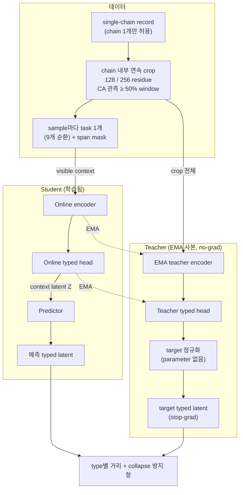
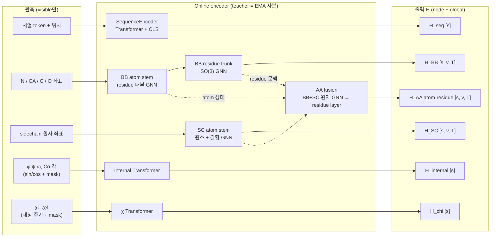
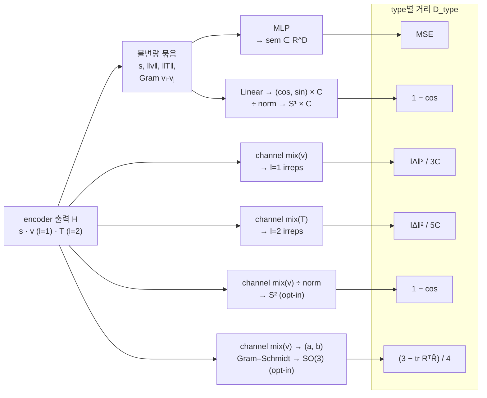
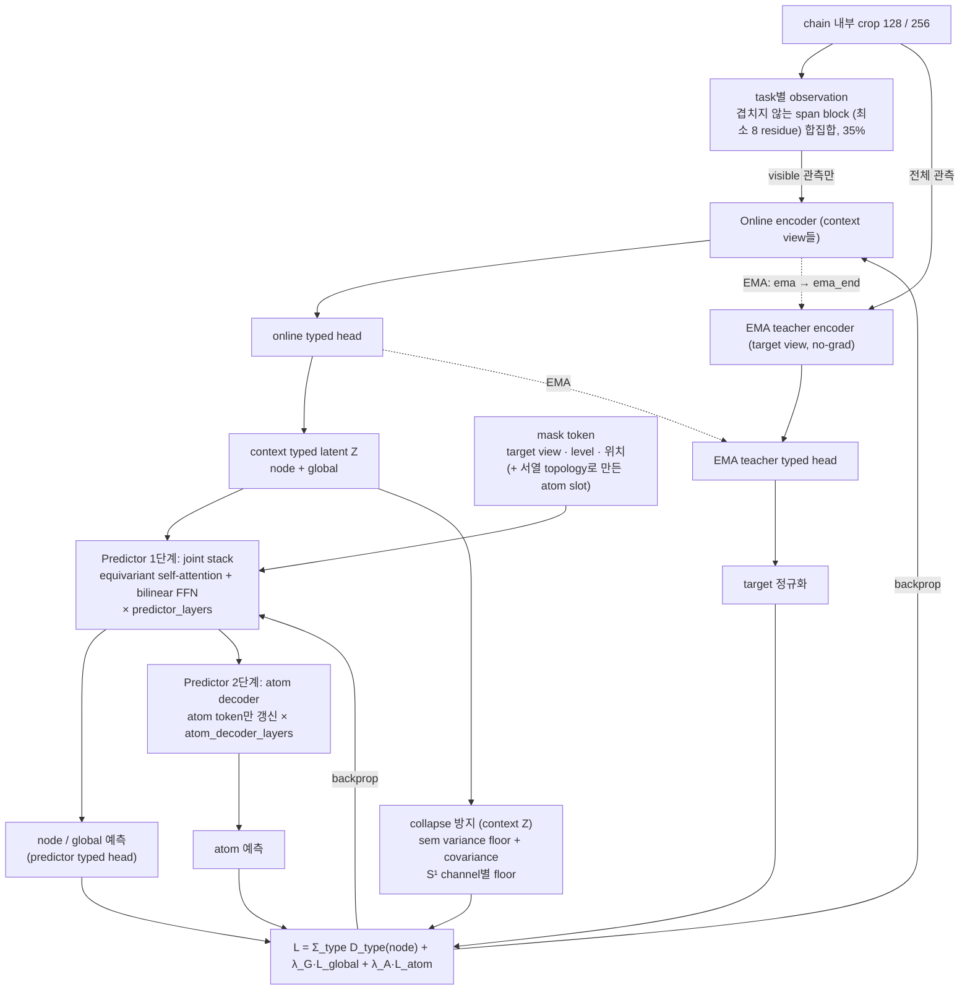
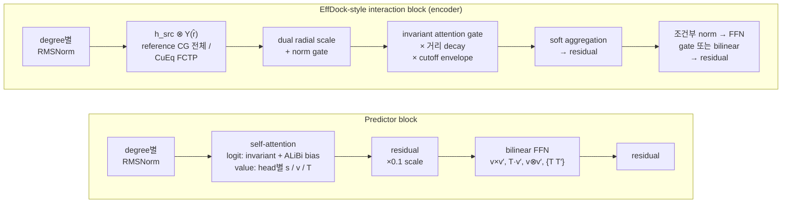

# Protein Geometric JEPA

**Sequence ↔ backbone ↔ sidechain/all-atom, with node-wise typed latent prediction.**

연구 구현(초기 개발 단계, 학습 전까지 버전 없음). Atom / residue / global 표현을 함께 유지하며, Sequence Transformer, backbone-only SO(3) GNN, SC atom branch, AA fusion, backbone internal-coordinate encoder와 χ encoder를 포함합니다. **Sidechain과 χ를 제외하지 않았습니다.**

## Typed latent (원래 설계 합의)

원래 설계 대화에서 합의한 **typed latent**를 구현했습니다. view마다 encoder 뒤에 학습되는 head가 있고, 이 head가 latent를 성질별 공간에 놓습니다.

| type | 공간 | 대상 view |
|---|---|---|
| semantic | R^D (invariant) | 모든 view |
| l=1 / l=2 irreps | SO(3) 등변 | bb, sc, aa |
| learned circles | S¹ (원) | bb, sc, aa, bb_internal, chi |
| direction | S² (단위 방향, 등변) | bb, sc, aa (기본 off, opt-in ablation) |
| frame | SO(3) (Gram–Schmidt) | bb, aa (기본 off, opt-in ablation) |

- **경로**: context Z = online head(H)이고 predictor는 Z만 읽습니다. target은 EMA teacher head(teacher H)입니다. head는 prediction loss로 학습됩니다. regularizer를 꺼도 이 성질이 유지되는 것을 테스트로 확인합니다.
- **Loss**: type마다 거리를 따로 씁니다. sem은 MSE, irreps는 Frobenius, 원과 방향은 1 − cos, frame은 chordal 거리입니다.
- **Collapse 방지**: sem에는 variance floor를 걸고, 원에는 channel별 floor를 겁니다. arXiv:2609.21656의 heat-kernel MMD(`torus_mmd`, `sphere_mmd`)는 ablation 옵션입니다.
- **실행 검증**: 단백질 22개로 실제 학습과 같은 방식의 확률적 overfit(random crop, 매번 새 mask, task 혼합, EMA)을 돌렸습니다. loss는 37%까지 떨어졌고, retrieval은 우연 수준의 6.8배이며 계속 상승 중이었습니다. 이때 covariance 항이 rank 붕괴를 막습니다. 실제 CuEq CUDA 경로도 Blackwell GPU에서 통과했습니다. 테스트는 CPU에서 189 passed / 2 CUDA skips, GPU에서 CuEq·학습 경로 24 passed입니다(`reports/typed_latent/pytest_*.txt`).
- **비교 기준**: `latent_typing: euclidean`이 all-Euclidean baseline입니다. 근거와 실험 결과는 [TYPED_LATENT_KO.md](docs/TYPED_LATENT_KO.md)에 있습니다. checkpoint는 format 7입니다. format 3·4·5·6의 weight는 당시 설정으로 추론용으로 읽지만 이어 학습은 하지 않습니다. format 1·2는 읽지 않습니다.

## Global 표현과 평가 진단

Sequence·internal view는 CLS를 쓰고 BB·SC·AA는 학습되는 global readout을 씁니다. 새 설정의 global latent는 context·teacher·predictor에서 모두 semantic + irreps입니다. Node의 circle·direction·frame head는 유지합니다. 전역 범위는 선택한 crop 전체입니다.

`encoder_global_transport: mean|learned`는 visible-only 전역 집계와 gated broadcast를 구조 encoder 안에 추가하는 opt-in 실험입니다(기본 `none`). Tower·record 경계를 유지하며 가짜 global 좌표를 만들지 않습니다. Mean 대조군과 함께 비교해야 하며 품질 개선은 아직 검증되지 않았습니다.

`sc_shape_features`는 기본 true입니다. 관측 SC 원자의 centroid−CA vector, centroid 주위 covariance의 trace와 STF tensor를 기존 scalar/vector/tensor 경로에 작은 residual로 넣고 AA fusion에 전달합니다. 숨겨진 SC를 CA로 대체하지 않으며 출력 latent 차원은 유지합니다. BB torsion·bond direction과 SC moment는 batch로 계산하고, 같은 observation의 BB feature는 한 forward 안에서 공유합니다. 이전 checkpoint에 shape 옵션이 없으면 false로 읽습니다. 범위와 CPU 측정은 [SC shape 보고서](reports/sc_shape/README.md)를 따릅니다.

`evaluate --controls --audit-content`는 retrieval·유효 target 수·global 다양성 및 context 내용 제거 대조군을 보고합니다. `--gradients`는 선택적인 task별 작은 gradient probe입니다. Exact 중복 검사, bounded sequence-identity screen과 frozen linear probe 사용·한계는 [TRAINING.md](docs/TRAINING.md), [API.md](docs/API.md)를 따릅니다. 실제 homology split과 downstream label 검증은 별도로 필요합니다.

## JEPA target·predictor 결함 수정

이전 구현을 실행해 확인한 결함을 고쳤습니다.

- Target projector가 학습되지 않아 l>0 target이 고정된 무작위 사영이었습니다. 지금은 EMA teacher의 typed head 출력을 parameter 없이 정규화해 target으로 씁니다(soft RMS floor와 log 크기 scalar). head는 prediction loss로 학습됩니다.
- Predictor는 cross-attention 1층에서 2단계 equivariant transformer로 바뀌었습니다. Joint stack 뒤에 atom decoder가 있고, relative position bias와 bilinear FFN을 씁니다.
- Atom query는 관측된 원자 목록이 아니라 visible sequence의 topology로 만듭니다.
- Mask는 겹치지 않는 multi-block span입니다. Task는 sample마다 섞이고, EMA는 schedule을 따릅니다.
- Reference message가 CG 경로 전체를 갖습니다.

Encoder 확장 네 가지(`sc_context: spatial`, `effdock_directional`, `effdock_ffn: bilinear`, `effdock_adaptive_cutoff`)는 opt-in 실험입니다. 네 가지를 모두 켠 설정은 `configs/jepa_full_cueq_gpu.yaml`입니다. 이전 형식의 checkpoint는 읽지 않습니다. 계획 단계에서 Codex, Claude, Antigravity council의 검토를 거쳤습니다. 근거와 검증 범위는 [JEPA_TARGETS_KO.md](docs/JEPA_TARGETS_KO.md)에 있습니다. 현재 테스트 결과는 아래 typed latent 절의 수치를 따릅니다. 품질 향상은 아직 검증하지 않았습니다.

## EFF-Dock-inspired CuEq interaction

`model.interaction: effdock`로 BB atom, SC atom, BB residue, AA atom, AA residue의 다섯 단계에서 새 블록을 사용할 수 있습니다. Shared tensor product, dual radial scaling, directed edge-type decay, degree-wise RMSNorm, invariant conditioning, gated aggregation 및 residual equivariant FFN을 통합했습니다. 기존 설정의 기본값은 `baseline`이라 과거 모델을 조용히 바꾸지 않습니다.

**실제 CuEq 0.9.0 CPU 연산을 GitHub CI에서 검증했습니다.** 전용 테스트 7개, 18-step 학습, 9개 task 역전파가 통과했습니다. 별도 reference CI는 Python 3.11/3.12/3.13에서 통과했고, 로컬 full suite는 123 passed / 9 optional skips입니다. 그 뒤 CuEq CUDA 경로도 Blackwell GPU에서 테스트와 22개 단백질 overfit으로 실행했습니다(`reports/typed_latent/`). 당시 검증 범위는 [INTERACTION_VALIDATION.md](docs/INTERACTION_VALIDATION.md)에 있습니다.

사전학습된 가중치나 downstream 성능 향상 주장은 제공하지 않습니다. Synthetic demo는 동작 검증이며, EFF-Dock의 docking checkpoint와 호환되는 모델이 아닙니다. [강화 분석](docs/EFFDOCK_UPGRADE_KO.md)에 원본과의 차이, tradeoff, ablation 및 후속 우선순위를 기록했습니다.

## 빠른 실행

Python 3.11 이상 환경에서:

```bash
git clone https://github.com/eightmm/protein-geometric-jepa.git
cd protein-geometric-jepa
python -m pip install -e '.[dev]'
pytest -q
protein-jepa demo --config configs/effdock_smoke.yaml --output runs/effdock-smoke
```

기존 baseline smoke는 `configs/smoke.yaml`입니다. Small smoke만 16/24 crop을 쓰며, `configs/effdock_reference.yaml`과 `configs/effdock_cueq_gpu.yaml`은 **128/256 parent crop**을 사용합니다. Output directory는 새 경로를 사용하거나 명시적으로 resume해야 합니다.

## 아키텍처

모든 구조 상태는 `Fiber = (s, v, T)`입니다. s는 scalar, v는 Cartesian vector(l=1), T는 대칭이고 trace가 0인 3×3 tensor(l=2, 자유도 5)입니다. 구조 경로(encoder, typed head, loss)는 정확히 SO(3) 등변/불변이고 평행이동에도 불변입니다. 그래서 회전·이동 augmentation은 기본으로 끕니다.

### 0. 한눈에 보기



학습되는 것은 online encoder, online typed head와 predictor뿐입니다. Teacher는 online 쪽의 EMA 사본이고 gradient를 받지 않습니다. 학습 중 표현 품질은 loss가 아니라 centred node retrieval(`node_top1`과 `chance` 비교)과 effective rank로 판단합니다. loss는 낮아졌는데 rank가 붕괴하는 경우를 실제로 관측했습니다.

### 1. View별 encoder 계층

상자 안의 `[...]`는 해당 encoder가 내보내는 성분입니다.



- BB 출력은 SC/AA 정보로 덮어쓰지 않습니다. AA fusion은 BB와 SC 상태를 **읽기만** 합니다(`test_aa_fusion_does_not_mutate_bb`).
- Internal과 χ encoder는 Cartesian graph를 보지 않습니다.
- SC atom stem은 기본(`sc_context: local`)으로 같은 residue의 원자만 봅니다.
- 구조 interaction block은 `interaction: baseline | effdock`, 연산 backend는 `backend: reference | cueq-naive | cueq-cuda`로 고릅니다.

### 2. Typed latent head

View마다 head가 하나씩 있고, encoder 출력 H를 성질별 공간 위의 latent로 바꿉니다. 같은 구조의 head가 online, teacher, predictor 출력 쪽에 있습니다.



| View | sem | l=1 / l=2 | S¹ | S² | SO(3) |
|---|---|---|---|---|---|
| seq | ✓ | | | | |
| bb_internal, chi | ✓ | | ✓ | | |
| sc | ✓ | ✓ | ✓ | opt-in | |
| bb, aa | ✓ | ✓ | ✓ | opt-in | opt-in |

- **Target 정규화**(teacher 쪽, parameter 없음):
  - sem은 crop 안의 valid token으로 instance norm을 하고, global token 하나는 layer norm을 씁니다.
  - l>0 성분은 token별 soft RMS로 나누고, 빠진 크기 정보는 log 크기 scalar 2개로 sem에 붙입니다.
  - S¹, S², SO(3)는 head에서 이미 manifold 위에 있습니다.
  - S²와 SO(3) target은 원래 vector가 충분히 클 때만 씁니다. 0에 가까운 vector를 단위화하면 방향이 무의미해지기 때문입니다.
- **좌표계 없는 context**: 서열만 보는 task처럼 context에 좌표계가 없으면 world frame에 묶인 성분(l=1/l=2, S², SO(3))은 loss에서 뺍니다.
- **Euclidean baseline**: `latent_typing: euclidean`은 같은 head에서 manifold 사영만 뺀 비교군입니다.

### 3. 학습 한 step



- **정보 경계**:
  - mask token에는 숨긴 좌표, frame, edge가 없습니다.
  - atom query는 관측 여부가 아니라 visible 서열의 topology로 만듭니다.
  - 1단계 token은 atom token을 보지 않습니다.
- **Target 경로**: teacher가 target을 만들 때 쓰는 가중치(encoder와 typed head)는 모두 online 경로에서 prediction loss로 학습됩니다. regularizer를 모두 꺼도 이 성질이 유지되는 것을 테스트합니다(`test_every_teacher_target_parameter_is_trained_online`).
- **Heat-kernel MMD**: arXiv:2609.21656의 `sphere_mmd`(sem)와 `torus_mmd`(S¹)는 기본 regularizer 대신 쓸 수 있는 ablation 옵션입니다.

| Task | Context | Target | l>0 loss |
|---|---|---|---|
| `seq_to_bb` | 일부 서열 | bb | 끔 |
| `bb_to_seq` | bb | seq | 끔 |
| `cart_to_internal` / `internal_to_bb` | bb ↔ bb_internal | 반대쪽 view | 끔 |
| `sc_to_chi` / `chi_to_sc` | sc ↔ (χ + bb) | 반대쪽 view | χ→sc만 켬 |
| `bb_infill` | 일부 bb | bb | 켬 |
| `sc_infill` | 서열 + bb + 일부 aa | aa (+ SC atom) | 켬 |
| `aa_infill` | 서열 + 일부 aa | aa (+ atom) | 켬 |

### 4. Block 내부



opt-in encoder 실험은 `sc_context: spatial`, `effdock_directional`, `effdock_ffn: bilinear`, `effdock_adaptive_cutoff` 네 가지입니다. 근거는 [JEPA_TARGETS_KO.md](docs/JEPA_TARGETS_KO.md)에 있습니다.

BB output은 좌표, polymer connectivity, backbone direction, frame, φ/ψ/ω, Cα pseudo-angle/dihedral만 사용합니다. SASA, DSSP, secondary-structure rule label이나 residue physicochemical lookup은 사용하지 않습니다. **l=2는 수학적으로 5차원**이며, 3×3 reference 저장 형식과 CuEq의 5-component basis는 명시적으로 변환합니다. 기본 global target은 원래 단백질 전체가 아니라 **선택한 crop 전체**입니다.

## 실제 CuEq 사용

```bash
python -m pip install 'cuequivariance==0.9.0' 'cuequivariance-torch==0.9.0'
python -m pip install -e '.[dev,cueq]'
python -c 'import cuequivariance, cuequivariance_torch'
pytest tests/test_cueq.py -m 'not cuda' -q
protein-jepa demo --config configs/effdock_cueq_naive.yaml --output runs/effdock-cueq-cpu
```

GPU는 호환되는 CUDA PyTorch와 matching CuEq ops wheel을 설치하고 [GPU 실행 gate](docs/UPGRADE_RUNBOOK.md)를 먼저 통과시킵니다. `reference`는 별도 analytic operator이며 CuEq가 없는 경우 몰래 대체되지 않습니다. Architecture와 backend 변경은 exact resume에서 거부합니다.

## 실제 데이터와 학습

```bash
protein-jepa prepare protein.cif --chain A \
  --sequence-map sequence_map.json --output data/protein_A.npz
protein-jepa audit-manifest data/train.jsonl
protein-jepa train --config configs/effdock_cueq_gpu.yaml \
  --manifest data/train.jsonl --output runs/effdock-pretrain
```

같은 task의 sample들은 하나의 disjoint-union batch로 묶어 계산합니다. 결과는 sample별 계산과 같고, task당 여러 sample이 모이도록 batch를 수십 단위로 잡으면 GPU 처리량이 오릅니다(batch 72에서 이전 대비 6.4배, [측정](reports/batching/README.md)). `sequence_map`은 원래 서열의 결손 위치까지 명시합니다. 없으면 `observed_order_unverified`이며 학습은 기본적으로 거부합니다. [DATA.md](docs/DATA.md)의 canonical indexing과 cluster-disjoint split 계약을 따르세요. Manifest 작성, 대규모 학습 및 downstream 검증을 자동 완료한 상태는 아닙니다.

## 검증과 ablation

```bash
python scripts/validate_effdock.py --config configs/effdock_smoke.yaml \
  --variants baseline effdock --lengths 128 256 --output runs/effdock-check.json
python scripts/make_effdock_ablations.py --base configs/effdock_cueq_gpu.yaml \
  --output runs/ablation-configs --seeds 17 29 43
```

두 번째 명령은 41개 variant × 3개 seed의 완전한 설정을 생성합니다. 구성은 interaction 10개, encoder·predictor 실험 6개, typed latent 2개, 기하 입력·global readout 3개, global 계약·transport 대조군 3개, SC shape 대조군 1개, masking·EMA·covariance·heat-kernel MMD 5개, 그리고 설계 명세 27절의 비교 11개(teacher-free, cosine, raw reconstruction, node-only, seq-only, task 부분집합, crop 크기)입니다. 이 명령은 **학습/job 제출을 시작하지 않습니다.** Equal-step/equal-compute 및 parameter-matched 비교를 구분하세요. 작은 smoke loss로 품질 순위를 판단하지 않습니다.

## 문서

| 문서 | 내용 |
|---|---|
| [SPEC_COMPLIANCE_KO.md](docs/SPEC_COMPLIANCE_KO.md) | 설계 명세의 절마다 구현 위치·확인 테스트·보류 항목 |
| [TYPED_LATENT_KO.md](docs/TYPED_LATENT_KO.md) | typed latent 계약·구현·council 기록·22개 단백질 overfit 결과 |
| [JEPA_TARGETS_KO.md](docs/JEPA_TARGETS_KO.md) | target·predictor 결함 수정, target·predictor 정의, council 기록, 검증 범위 |
| [EFFDOCK_UPGRADE_KO.md](docs/EFFDOCK_UPGRADE_KO.md) | 원본 EFF-Dock 비교, 수식, 강화 tradeoff, 후속 분석 |
| [UPGRADE_RUNBOOK.md](docs/UPGRADE_RUNBOOK.md) | CPU/CuEq/GPU gate, 학습·resume·DDP·ablation |
| [INTERACTION_VALIDATION.md](docs/INTERACTION_VALIDATION.md) | 이번 릴리스의 실행 증거·CI·미검증 범위 |
| [SPEC_KO.md](docs/SPEC_KO.md) | 기본 JEPA 설계, view·mask·latent·loss 계약 |
| [DATA.md](docs/DATA.md) | PDB/mmCIF, PLMol adapter, sequence alignment, manifest |
| [CUEQ.md](docs/CUEQ.md) | Backend와 irrep basis 변환, compatibility |
| [TRAINING.md](docs/TRAINING.md), [API.md](docs/API.md) | 기본 학습·추론·downstream API |
| [STATUS.md](docs/STATUS.md) | 구현·검증·후속 연구의 구분 |
| [PUBLICATION.md](docs/PUBLICATION.md), [VALIDATION.md](docs/VALIDATION.md) | 초기 게시·검증 기록 |

소유자가 만든 **public** 저장소 설정을 유지합니다. `eightmm/EFF-Dock`와 `eightmm/plmol`은 변경하지 않았습니다. 공개 라이선스 선택은 소유자 결정 사항으로 남아 있습니다. 원본 이전 구현의 76개 파일은 `2b2ee750edd53c3d1e5b836b77d71d63b0b370e1` 커밋에 보존되어 있습니다. 새 릴리스의 실험 증거는 `reports/interaction/`에 별도로 기록합니다.
